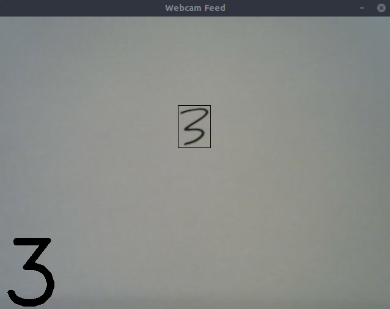
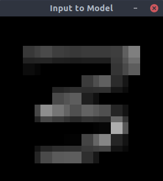
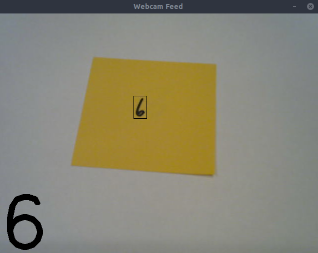
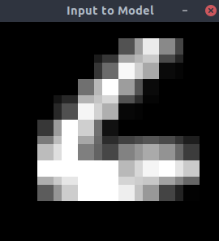

# mnist-demo

A program that you can use to demo mnist handwritten digits with your own digits using a webcam.

## Usage

- run `model_training.py` to train a model and save it as `model.h5`
- run `main.py` to run the program and press the 'q' key to exit

Two windows should pop up:

- Webcam Feed: data from webcam, along with region of interest rectangle and prediction on bottom left
- Input to Model: the image that the model receives as input

Also, pressing the 'f' key will flip the webcam's orientation. This is for writing digits on the other side of a webcam (assuming the webcam is pointing down).

## Environment

My environment used to develop this project:

- Ubuntu 18.04.1
- Python 2.7.15rc1
- NumPy 1.15.2
- OpenCV 3.2.0
- TensorFlow 1.11.0
- SciPy 1.1.0

## Note

This project is still a work in progress.

## Examples

Note: images are outdated, but give a general idea of what to expect

